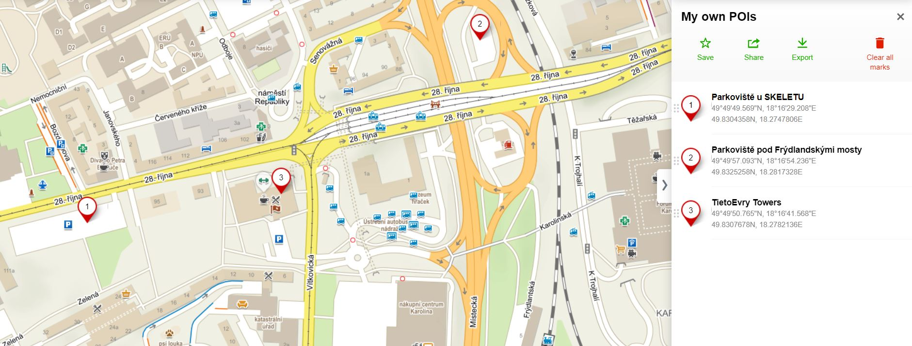

# Kde zaparkovat zadarmo, když jdete na kurz konaný v Tieto Towers v Ostravě

V okolí Tieto Towers na adrese 28. října 3346/91, 70200 Ostrava - Moravská Ostrava se dá zaparkovat na mnoha různých místech a to i zadarmo.

**Já vám doporučuji zaparkovat na parkovišti (1), které je vedle budovy s názvem Skelet a naproti Domu kultury města Ostrava** nebo na parkovišti (2) pod Frýdlandskými mosty. Obě jsou bezplatná, několik minut pěšky vzdálená a v době, kdy se konají kurzy PyLadies je zde i možné bez problémů najít volné místo.

Samozřejmě jsou zde i další místa, kde se dá zaparkovat zdarma, ale to už vyžaduje znalost místních poměrů.

Pozor na to, že některá parkoviště jsou zpoplatněná (např. naproti Tieto Towers parkoviště u OC Karolína = Kaufland a další obchody) případně jsou zde nastaveny různé zóny (sídliště v blízkosti Tieto Towers), kde se dá parkovat na modře vyznačených místech s parkovací kartou na 2 hodiny zdarma.

Dále je možné využít parkoviště v nedalekém centru Forum Nová Karolína, která má velká podzemní parkoviště. Zde jsou 2 hodiny parkování zdarma a každá další započatá hodina za 30 Kč. Do Tieto Towers se pak nejlépe dostanete po lávce, která je přístupná z nejvyššího patra obchodního centra a končí mezi autobusovým nádražím a OC Karolína (Kaufland) naproti Tieto Towers.

Pokud ale mohu doporučit parkování všem, kteří to tu příliš neznají, pak volím parkoviště (1).

**Polohu parkovišť (1) a (2) a Tieto Towers (3) najdete na mapě ZDE:** 
https://en.mapy.cz/s/cevagagure

