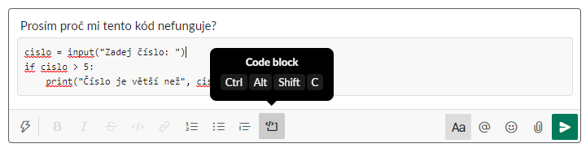

# Jak na SLACK přidat PYTHON KÓD tak, aby se zobrazil jinak, než ostatní text

Existuje několik možností, které se hodí pro různé situace

## Zvýrazni kousek kódu v textu zprávy
Zvýrazni **KOUSEK KÓDU** v textu zprávy pomocí ikony **"Code"** na panelu nástrojů. Hodí se hlavně v situaci, kdy chceš ve zprávě oddělit kousek textu jako kód. Můžeš použít i klávesovou zkratku (viz obrázek) nebo při psaní zprávy použít znak backtick (\`text\`).

  
 
## Zvýrazni několik řádků kódu v textu zprávy
Zvýrazni **ŘÁDEK KÓDU** (nebo několik) v textu zprávy pomocí ikony **"Code block"** na panelu nástrojů. Také tady můžeš použít klávesovou zkratku (viz obrázek) nebo uzavřít text do trojitého znaku backtick (\`\`\`text\`\`\`).

  

  **TIP**: Jak jistě víš, po zmáčknutí klávesy ENTER se tvoje zpráva pošle. Jak tedy do jedné zprávy vložit odřádkování, aniž by se zpráva poslala? Použij klávesovou zkratku ALT(levý)+ENTER.

## Vlož celý kód pomoci snippet
"Code block" se hodí v případě, kdy posíláš pár řádků. Pro vložení **CELÉHO PROGRÁMKU** je lepší použít ikonku blesku na panelu nástrojů a vybrat **"Create a code or text snippet"**. Můžeš tak vložit delší kód, který se na Slacku zobrazí sbalený a vlákno tak bude více přehledné.

  

  **TIP**: V dalším okně si v nabídce "Type" vyber Python a kód se obarví podle pravidel Pythonu.

  

  Ve vlákně to pak vypadá takto:

  

  Kód lze jednoduše rozbalit a sbalit podle potřeby.
 
## Vlož celý soubor
Vlož celý prográmek **JAKO SOUBOR** pomocí ikony **"Attach file"** jako přílohu (Slack podporuje i "Drag and drop"). Výstup je podobný, jako když použiješ snippet.
